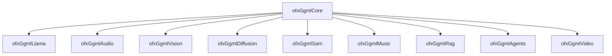

# ofxGgml Dependency Graph

This file is generated from `ecosystem.json`.

To regenerate:

```sh
python3 scripts/generate-ecosystem-dashboard.py
```

Expected graph shape:


```mermaid
graph TD
  Core[ofxGgmlCore]
  Core --> ofxGgmlLlama[ofxGgmlLlama]
  Core --> ofxGgmlAudio[ofxGgmlAudio]
  Core --> ofxGgmlVision[ofxGgmlVision]
  Core --> ofxGgmlDiffusion[ofxGgmlDiffusion]
  Core --> ofxGgmlSam[ofxGgmlSam]
  Core --> ofxGgmlMusic[ofxGgmlMusic]
  Core --> ofxGgmlRag[ofxGgmlRag]
  Core --> ofxGgmlAgents[ofxGgmlAgents]
  Core --> ofxGgmlVideo[ofxGgmlVideo]
```
