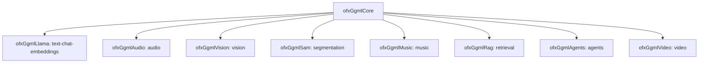

# ofxGgml Dependency Graph

```mermaid
graph TD
  Core[ofxGgmlCore]
  Core --> ofxGgmlLlama[ofxGgmlLlama: text-chat-embeddings]
  Core --> ofxGgmlAudio[ofxGgmlAudio: audio]
  Core --> ofxGgmlVision[ofxGgmlVision: vision]
  Core --> ofxGgmlSam[ofxGgmlSam: segmentation]
  Core --> ofxGgmlMusic[ofxGgmlMusic: music]
  Core --> ofxGgmlRag[ofxGgmlRag: retrieval]
  Core --> ofxGgmlAgents[ofxGgmlAgents: agents]
  Core --> ofxGgmlVideo[ofxGgmlVideo: video]
```

All companion addons should depend on Core for shared backend-neutral primitives and keep domain-specific workflows in their own repository.
